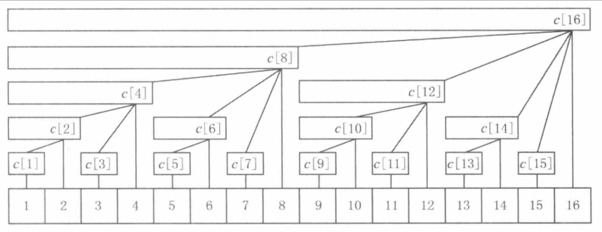

# 从前缀和到树状数组 -- 树状数组原理篇

## 树状数组引入: 从前缀和到树状数组

前缀和: `preSum[i]` 表示: `num[:i]`区间内的元素和

前缀和的特点: 

1. Query: 获取某一段区间的元素和, 时间复杂度 `O(1)`
2. Update: 单点修改, 由于单点修改后需要更新前缀和数组当前下标以及后续所有下标位置的`preSum`元素的值, 因此时间复杂度是 `O(n)`

因此我们考虑, 能不能有更优的数据结构, 使得Query和Update的时间复杂度更低?

解决方法1: 分组前缀和

通过之前的分析不难发现, 之所以Update的时间复杂度很高, 是因为对于`preSum[i]`而言, 其维护了`nums[:i]`区间的所有元素的和, 因此只要`[0, i]`区间的任何一个元素发生修改, `preSum[i]`都需要改变

因此我们可以减少`preSum[i]`维护的元素数量, 一种朴素的想法是对`nums[]`中的元素进行分组, `preSum[i]`只是维护其中某一组的元素和

具体来说, 假设`nums[]`一共有`n`个元素, 我们让`b`个元素为一组, 那么一共就有`n / b`组

这样分组之后, 进行Query操作时, 只需要看要查询的区间有多少是 "整组" 的, 整组的可以直接相加得到, 再看看有多少是还没到一个组的, 这些直接暴力求和, 因此Query的时间复杂度为`O(n / b)`, 类似的, 由于Update操作只需要更新同一组内的这些前缀和, 因此更新操作的时间复杂度是`O(b)`

通过分组的方式, 我们将更新操作(Update)的影响范围缩小到了组内, 将Update操作的时间复杂度从`O(n)`降低到了`O(b)`, 代价就是Query的时间复杂度从`O(1)`升高到了`O(n / b)`

在最优的分组情况下, `b = sqrt(n)`, 因此Query和Update的时间复杂度都是`O(sqrt(n))`

有没有一种更优的分组方式, 使得Query和Update的时间复杂度变得更低呢??

这就是树状数组了, 在树状数组中, Query和Update操作的时间复杂度都是`O(logn)`级别的

## 树状数组原理

树状数组通过 "二进制分组" 的方式, 让Query和Update操作的时间复杂度都降低到`O(logn)`级别

树状数组的拆分规则: 根据二进制进行拆分

如果把一个正整数`i`拆分成若干个不同的2的幂, 那么只会拆分出`O(logi)`个数

树状数组就是按照这样的规则对区间进行拆分的

假设现在有一个区间`[1, 13]`, 其中13的二进制为`1101`, 那么可以将13拆分成`13 = 8 + 4 + 1`, 相应的, `[1, 13]`这个区间就可以被拆分成三个区间: `[1, 8], [9, 12], [13, 13]`

按照类似的规则, 我们可以写一下从`[1, 1]`到`[1, 8]`依次都是怎么拆分的

`[1, 1]  1 = 1B = 1         --> [1, 1] = [1, 1]`

`[1, 2]  2 = 10B = 2        -->  [1, 2] = [1, 2]`

`[1, 3]  3 = 11B = 2 + 1     --> [1, 3] = [1, 2] + [3, 3]`

`[1, 4]  4 = 100B = 4       --> [1, 4] = [1, 4]`

`[1, 5]  5 = 101B = 4 + 1    --> [1, 5] = [1, 4] + [5, 5]`

`[1, 6]  6 = 110B = 4 + 2    --> [1, 6] = [1, 4] + [5, 6]`

`[1, 7]  7 = 111B = 4 + 2 + 1  --> [1, 7] = [1, 4] + [5, 6] + [7, 7]`

`[1, 8]  8 = 1000B = 8  --> [1, 8] = [1, 8]`


在上面的式子中, 等号右边, 一共只有**8个**不同的区间

> 可以使用类似DP的思想来理解上面这句话, 对于`[1, i]`的区间, 假设`i`的最小二进制数是`b`, 那么我们可以首先拆分出来一个`[i - b + 1, i]`的区间, 对于剩下的区间`[1, i - b]`, 这个区间显然是一个**规模更小的子问题**, 并且这个`[1, i - b]`这个区间之前显然拆分过了, 因此**每次都只会增加一个新的小区间**

我们把每次新增的小区间, 叫做**关键区间**

总结一下拆分区间的过程: 假设我们想要拆分`[1, i]`这个区间, 首先我们拆分出来一个长度为`lowbit(i)`的区间, 即拆分成`[1, i] = [1, i - lowbit(i)] + [i - lowbit(i) + 1, i]`这两个区间, 其中`[i - lowbit(i) + 1, i]`这就是一个关键区间, 接下来再**递归的**拆分`[1, i - lowbit(i)]`这个区间即可



> 图中每个`c[i]`, 维护一个关键区间的元素和

接下来考虑要想查询`[1, i]`区间的元素和, 需要查询多少个**关键区间**的元素和?

通过上面的拆分规则可以发现, `[1, i]`区间拆分出来的关键区间个数, 不会超过`i`的二进制数中`1`的数量, 即不会超过`O(logn)`个关键区间, 因此查询的时间复杂度是`O(logn)`

接下来关键是考虑更新的情况

考虑一个具体的情况, 假设我们要修改下标为`10`位置的元素, 那么分析哪些关键区间的元素和会发生变化?

从上面的图中可以得到, 包含下标`10`的关键区间有`[9, 10], [9, 12], [9, 16], ...`, 对应`c[]`数组就是`c[10], c[12], c[16], ...`

> 具体来说, 这里的`c[i]`, 维护的是 **以`i`为右端点的关键区间**的元素和

那么关键区间的这些下标`10, 12, 16, ...`有什么规律呢

考虑这些数字的二进制

`10 = 8 + 2  = 01010B`

`12 = 8 + 4  = 01100B`       `12 - 10 = 2 = 10B = lowbit(10)`

`16 = 16     = 10000B`       `16 - 12 = 4 = 110B = lowbit(12)`

可以发现 (或许并不是那么显然) 从上往下看, 每两个关键区间的右端点的下标之差, 就是**前一个右端点下标的的`lowbit`**

因此我们可以**大胆猜测**: 包含`10`的所有关键区间, 其右端点为: 从`10`开始, 每次增加前一个区间右端点的`lowbit`, 满足上述要求的这些右端点, 都是包含`10`的关键区间的右端点

具体的证明过程可以看灵神题解: [灵神题解](https://leetcode.cn/problems/range-sum-query-mutable/solutions/2524481/dai-ni-fa-ming-shu-zhuang-shu-zu-fu-shu-lyfll/)

通过上面的分析我们可以知道, 要想找到包含下标`i`的所有关键区间(右端点), 只需要从当前下标`i`开始, 每次加上前一个右端点的`lowbit`, 就可以找到所有包含下标`i`的关键区间右端点

显然一直加`lowbit`, 直到数组越界了就不再加了, 在这个过程中, 由于每次加上的`lowbit`都是递增的, 因此最多加`logn`次`lowbit`, 因此我们得出, 更新操作的时间复杂度是`O(logn)`的

> 总结一下区间拆分和更新的过程: 
> 
> 拆分区间时, 每次让`i - lowbit(i)`, 即拆分出一个大小为`lowbit(i)`的区间出来, 递归的向前拆分
> 
> 更新区间时, 从`i`开始, 接下来的一个区间是`i + lowbit(i)`, 一直向后寻找

> 什么是`lowbit`?
>
> 假设当前有一个二进制数字`10010B`, 我们想要求`lowbit(10010B)`, 应该如何求出来?
>
> `        i = 10010B`
>
> `       ~i = 01101B`
>
> `(~i) + 1 = 01110B`
>
> 可以发现, 在`i`最右侧的1左边的所有二进制, `i`和`(~i) + 1`完全相反, 在右边(包括最右侧的1)的所有二进制, `i`和`(~i) + 1`完全相同
>
> 因此如果我们让`i & ((~i) + 1)`, 那么就会得到`00010B`, 即得到了`lowbit(i)`, 也就是`lowbit(i) = i & ((~i) + 1)`
>
> 而由于补码的运算规则, `-i = (~i) + 1`, 即从`i[补] --> (-i)[补]`, 所需要做的操作是: 对`i`各个位取反(包含符号位), 然后末尾`+ 1`
>
> 因此上式可以简化为`lowbit(i) = i & (-i)`
>
> 更进一步的小技巧: `i -= lowbit(i)`, 可以进一步简写成`i &= (i - 1)`
>
> 我们可以感性的认识一下上面这个式子, 首先`i -= lowbit(i)`, 即去掉`i`的`lowbit(i)`, 而`i - 1`, 相当于是将`i`最右侧的1减掉, 并且将右边变成全1, 即`i - 1`相对于`i`来说, `i`最右侧的1左侧(不包括最右侧的1), 所有二进制为都不变, 右侧(包括最右侧的1), 所有二进制位都取反, 这样在让`i`和`i - 1`进行`&`操作, 之后得到的就是去掉`lowbit(i)`之后的结果


树状数组中前缀求和 以及 更新操作的实现流程

1. 前缀求和: 通过上面的分析可以知道, 给定某一个区间, 要想求这个区间的元素和, 即求这个区间拆分出来的所有**关键区间**的元素和, 而上面我们也分析过了, 要想找一个区间拆分出来的关键区间的右端点, 只需要对当前区间的右端点进行不断的`-lowbit()`操作即可

```java
// 求[1, i]区间的元素和
private int pre(i){
    int ret = 0;
    while(i > 0){
        ret += tree[i];
        i &= i - 1;
    }
    return ret;
}
```

2. 更新操作: 当我们想要更新下标为`i`的元素时, 需要更新所有包含`i`这个下标的关键区间的元素和, 而要想找到所有包含`i`这个下标的关键区间, 只需要不断的进行`+ lowbit()`操作即可

```java
// 对下标为i的元素进行 + x 操作
private void update(int i, int x){
    while(i < tree.length){
        tree[i] += x;
        i += i & (-i);
    }
}
```