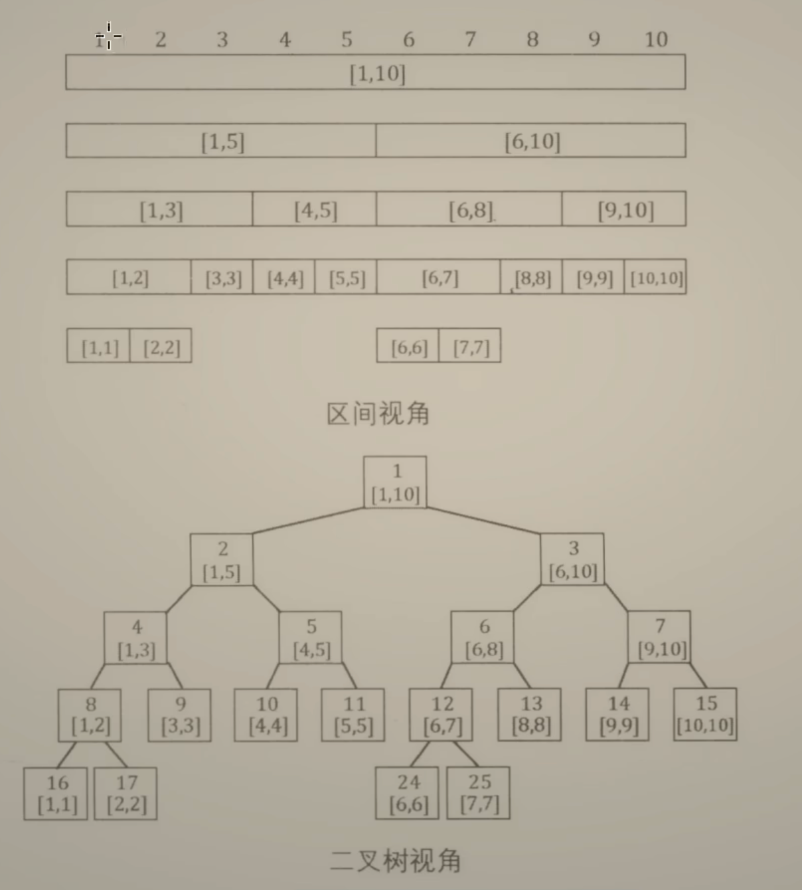

# 线段树

给定一个数组, 有如下操作: 

1. 区间修改
2. 区间查询

一种自然的想法是, 我们维护所有的子数组, 假设原数组的长度为`n`, 那么所有的子数组一共有`n ^ 2`个

那么一次区间查询, 可以在`O(1)`的时间内得到答案, 但是修改操作, 就需要修改可能影响到的所有子数组, 因此修改的时间复杂度是`O(n ^ 2)`的

和树状数组类似, 我们可以考虑平衡上述两个操作的时间复杂度

一种改进的想法是, 之前我们维护了所有的子数组, 一共有`O(n ^ 2)`个, 这有点多, 因此这里我们考虑少维护一些子数组, 仅仅维护`[i, i]`这些子数组, 即`[1, 1], [2, 2], ...`, 这样子数组一共有`O(n)`个, 因此查询的时间复杂度变为`O(n)`, 类似的, 更新的时间复杂度也是`O(n)`

如果存在多个(q个)查询, 那么查询Query的时间复杂度是`O(q * n)`, 更新的时间复杂度是`O(n)`, 有没有一种更均衡的方案?

不妨尝试多维护一些区间, 比如

我们将相邻的区间两两合并

```
    [0,1]       [2,3]        [4,5]       [6,7]
    /   \       /   \        /   \       /   \
 [0,0] [1,1] [2,2] [3,3]  [4,4] [5,5] [6,6] [7,7]
```

这样如果我们想要查询`[0, 5]`区间内的元素和, 只需要查询合并之后`[0, 1], [2, 3], [4, 5]`这三个区间的元素和即可

因此将原来`O(n)`的查询时间优化成了`O(n / 2)`的时间复杂度

在这种情况下, 查询的时间复杂度是`O(q / 2 * n)`, 更新的时间复杂度是`O(n)`, 这两者就相对平衡了一点

我们还可以进一步合并

```
                     [0, 7]
              /                     \
          [0,3]                    [4,7]
         /     \                  /     \
    [0,1]       [2,3]        [4,5]       [6,7]
    /   \       /   \        /   \       /   \
 [0,0] [1,1] [2,2] [3,3]  [4,4] [5,5] [6,6] [7,7]
```
这样如果我们还是查询`[0, 5]`这个区间, 那我们只需要计算`[0, 3], [4, 5]`这两个区间的和即可

这其实就是线段树的雏形

考虑一共维护了多少个区间? 假设原数组的长度为n, 并且n为2的幂

那么总的区间数量为`n + n / 2 + ... + 1`

如何计算这个式子? 在[灵神的讲解视频](https://www.bilibili.com/video/BV18t4y1p736/?spm_id_from=333.999.0.0)中, 提供了一种很巧妙的计算方法

如果我们在`n + n / 2 + ... + 1`的末尾补上一个1, 那么可以两两合并, 最终合并之后变成`2 * n`, 因此`n + n / 2 + ... + 1 = 2 * n - 1` (减一的原因是减掉补上的那个1)

因此我们得到, 总的区间数量为`2 * n - 1`

换句话说, 我们可以使用`O(n)`数量级的区间, 来降低查询的时间复杂度

具体查询的时间复杂度降低到了多少?

```
                     [0, 7]
              /                     \
          [0,3]                    [4,7]
         /     \                  /     \
    [0,1]       [2,3]        [4,5]       [6,7]
    /   \       /   \        /   \       /   \
 [0,0] [1,1] [2,2] [3,3]  [4,4] [5,5] [6,6] [7,7]
```

通过这个图我们可以猜测一下, 要想查询一段区间的元素和, 猜测需要在每一层都选一个区间出来累加, 因此猜测单次查询的时间复杂度应该是`O(logn)`级别的

再回到查询和更新的时间复杂度对比, 这里我们维护的区间数量级还是`O(n)`, 因此更新的时间复杂度还是`O(n)`, 而查询的时间复杂度经过猜测, 应该是`O(logn)`, 查询`q`次的时间复杂度就是`O(q * logn)`, 经过这样的调整之后, 更新和查询的时间复杂度就比较接近了

上面的这个模型, 其实就是线段树了

但是在写线段树的代码之前, 我们还需要考虑几个问题

1. 对于不是2的幂的n, 我们需要维护多少个区间?

考虑一个例子, 假设我们的数组有10个元素, 下标范围是`[1, 10]`

> 划分原则: 对于`[i, j]`区间来说, 划分为`[i, (i + j) / 2], [(i + j) / 2 + 1, j]`这两个区间

```
                        [1, 10]
                /                      \
            [1, 5]                   [6, 10]
          /           \                 /              \
      [1, 3]        [4, 5]          [6, 8]          [9, 10]
       /   \        /   \           /     \         /     \
    [1,2] [3,3]  [4,4] [5,5]     [6,7]   [8,8]   [9,9] [10,10]
    /    \                       /    \
 [1,1] [2,2]                  [6,6] [7,7]
```

我们可以将整棵树近似看成是一棵满二叉树, 那么上面这棵如果看成是满二叉树的话, 一共有`1 + 2 + 4 + 8 + 16 = 31`个区间, 因此一种简单的估算方法是: 认为一共需要有`4 * n`个区间, 这样估计出来的区间个数肯定能够满足要求, 但是这样会浪费一些空间

灵神提供了一种较为精确的估算方法

首先我们考虑补成满二叉树的过程, 将上面的这棵树补成满二叉树, 实际上对应的满二叉树的最底下一层的节点数量, 就是**大于n并且最小的2的幂次**, 在上面这个例子中, 大于10并且最小的2的幂次, 就是16, 因此对应的满二叉树的最下层节点数量就是16

而 大于n并且最小的2的幂次 , 可以看作是 2 ^ (n的二进制长度), 或者也可以看做是 `1 << n的二进制长度`

对于满二叉树而言, 最下层节点数量和层数的关系满足: 最下层节点数量 = 2 ^ 层数 (层数从0开始计数)

同时, 对于满二叉树而言, 总的节点数量和层数的关系满足: 总节点数量 = 2 ^ (层数 + 1) - 1

通过上面两个式子可以得出 最下层节点数量和总节点数量的关系: 总节点数量 = 最下层节点数量 * 2 - 1

综上所述, 我们可以得到一个更加精确的总节点个数的估计: `总节点个数 = 1 << (n的二进制长度 + 1) - 1`

而又因为线段树中的区间下标要从1开始, 因此线段树的数组大小应该在总节点个数的基础上再 +1 , 即线段树的数组大小应该开`1 << (n的二进制长度 + 1)`这么大, 或者也可以写成`2 << n的二进制长度`

> 要想求n的二进制长度, Java中可以用`32 - Integer.numberOfLeadingZeros(n)`

线段树的具体操作实现

1. `add`操作

    入参: 

    1. `int o`: 当前节点下标
    2. `int l, int r`: 当前节点所在的区间范围
    3. `int idx`: 要修改的节点下标
    4. `int val`: 下标为`idx`的节点要增加的值
   
   具体执行流程: 由于下标为`idx`的节点会被多个区间维护, 因此我们采用递归 + 回溯的方式来更新线段树中的所有相关的节点

   具体来说: 从当前节点`o`开始, 递归的在左右子树中寻找下标为`idx`的叶子结点, 递归找到下标为`idx`的叶子节点之后, 由于所有覆盖了`idx`这个下标的区间也需要更新, 因此我们在找到叶子节点之后的回溯过程中, 使用左子树`2 * i`以及右子树`2 * i + 1`来更新当前节点`i`, 即`sum[i] = sum[2 * i] + sum[2 * i + 1]`

   具体函数如下
   ```java
   // 调用方式: add(1, 1, n, idx, val)
   // 给数组idx下标的元素增加val
   private void add(int o, int l, int r, int idx, int val){
        if(l == r){
            // 如果递归到了叶子节点, 那么直接修改
            sum[idx] += val;
            return;
        }
        // 不是叶子节点, 判断是在左子树还是右子树, 继续递归
        int mid = (l + r) >> 1;
        if(idx <= mid) add(o * 2, l, mid, idx, val);
        else add(o * 1 + 1, mid + 1, r, idx, val);
        // 最后在回溯的过程中更新当前节点
        sum[o] = sum[2 * o] + sum[2 * o + 1];
   }
   ```

2. `query`操作
   
   入参: 

    1. `int o`: 当前节点
    2. `int l, int r`: 当前节点所在的区间范围
    3. `int L, int R`: 要查询的区间范围`[L, R]`

    具体流程: 和`add`类似, 也是递归进行查询, 首先判断当前节点所在区间`[l, r]`是否包含在要查询的区间`[L, R]`当中, 如果包含在要查询的区间里面, 那么可以直接返回当前这个节点所在区间的元素和, 即直接`return sum[o];`

    否则的话, 需要判断要查询的区间`[L, R]`和当前区间的左右子树的区间`[l, mid], [mid + 1, r]`的关系 其中`mid = (l + r) >> 1`

    如果当前区间的左子树的区间`[l, mid]`包含要查询的区间`[L, R]`, 那么就递归左子树进行查询

    类似的, 如果当前区间的右子树的区间`[mid + 1, r]`包含要查询的区间`[L, R]`, 那么就递归右子树进行查询

    > 需要注意的是, 上述两种情况不是互斥的, 因此必须使用两个`if`来写

    具体函数如下: 
    ```java
    // 调用方式: query(1, 1, n, L, R)
    // 返回[L, R]区间的元素和
    private int query(int o, int l, int r, int L, int R){
        if(L <= l && R >= r){
            // 当前节点所在区间[l, r]包含在要查询的区间[L, R]当中, 直接返回
            return sum[o];
        }
        // 递归查询
        int sum = 0;
        int mid = (l + r) >> 1;
        if(L <= mid) sum += query(2 * o, l, mid, L, R);
        else sum += query(2 * o + 1, mid + 1, r, L, R);
        return sum;
    }
    ```

3. 上面两个函数的调用入口

    需要注意的是, 当调用上面两个函数进行`add`和`query`时, 一开始的节点都应该是根节点, 即`o = 1, l = 1, r = n`, 因此调用入口应该为`add(1, 1, n, idx, val)`以及`query(1, 1, n, L, R)`

    并且需要注意的是, 在线段树中, 我们的数组下标都是从`1`开始的

## Lazy线段树

线段树要解决的问题: 

1. 区间更新
2. 区间查询

线段树的两大思想: 

1. 挑选`O(n)`个特殊区间, 使得任意区间可以拆分为`O(logn)`个特殊区间
    
    

    


