# z-func

首先介绍一下z函数的作用: z函数是用来快速判断一个字符串 某一个后缀 和 整个字符串 的匹配长度

具体来说: 

假设有一个字符串str, 那么这个字符串对应的z函数的含义如下: 

`z[i]` 表示字符串str中`[i, n - 1]`区间的子串(`n = str.length()`)和整个字符串`str`的匹配长度

**计算方法**

这里通过两个例子来解释z函数的主要思想

### 示例1

`str = "abababzabababab"`

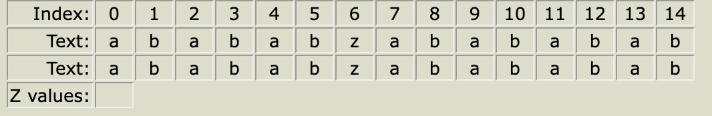

1. `z[0]` 这里指的是`str`这个字符串自身和自身匹配, 因此这里没有计算的意义, 如果一定要计算, 那么可以认为`z[0] = str.length()`
2. `z[1]` 这里由于没有任何前置条件, 因此只能暴力匹配, 比较`str[1]`与`str[0]`是否匹配, 发现不匹配, 因此`z[1] = 0`
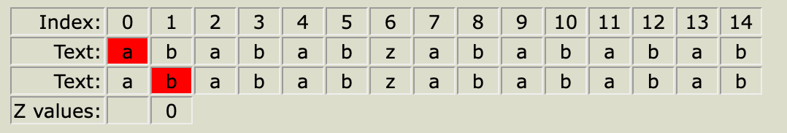
3. `z[2]` 在之前的计算中(即计算`z[1]`的过程中), 并没有给当前的计算提供额外的信息(具体可能会提供什么样的信息, 在后面都会提到), 因此这里还是暴力匹配, 比较`str[2]`与`str[0]`是否相等, 发现相等, 因此继续比较`str[3]`与`str[1]`, ... 一直比较到 `str[6] != str[4]`, 因此得出`z[2] = 4`
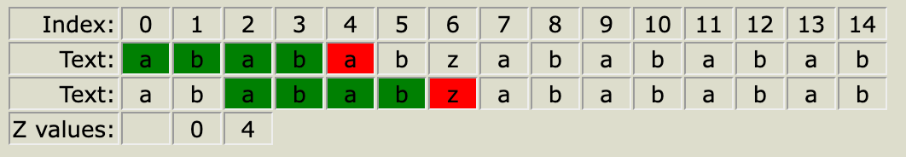
4. 引入`z-box`: 通过`z[2]`的计算, 我们可以得到这样的信息: str字符串中, [2, 5]区间的子串, 和str的前缀是匹配的, 因此我们将str [2, 5] 的这个区间, 记作 z-box, z-box的作用在之后的计算中会用到
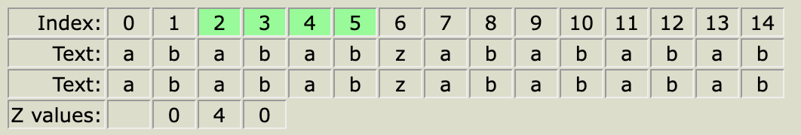
5. `z[3]`: 暴力比较 `str[3]`和`str[0]`是否相等, 发现`str[3] != str[0]`, 因此`z[3] = 0`
6. `z[4]`: 4 这个下标落在了 z-box 中, 因此 z-box 可以为`z[4]`的计算提供一些信息: 
   
    首先我们想要知道`str[4]`和`str[0]`是否匹配, 可以转化一下, 由于4这个下标在当前的 z-box 当中, 那么意味着`str[4] == str[2]` (因为当前 z-box 的含义是 str [0, 3] 区间的字符串 和 [2, 5] 区间的子串匹配) 并且 之前我们计算出来了 `z[2] == 4` , 也就意味着 `str[2] == str[0], str[3] == str[1], ... str[5] == str[3]` 那么通过 `str[4] == str[2], str[2] == str[0]` 这两个式子我们可以得到 `str[4] == str[0]` 因此我们知道`z[4]`至少是1
    
    接下来需要判断 `str[5]`和`str[1]`是否匹配, 由于5这个下标依旧在当前的 z-box 当中, 因此仍然有`str[5] == str[3]`, 并且从之前计算出来的`z[2]`的信息中我们可以知道有这一串式子: `str[2] == str[0], str[3] == str[1], ... str[5] == str[3]`, 其中就有 `str[3] == str[1]`, 因此我们得到`str[5] == str[1]`, 因此`z[4]`至少是2

    继续判断`str[6]`和`str[2]`是否相等, 由于6这个下标已经超出了当前 z-box 的范围, 因此这次就不能利用之前 z-box 中的信息了, 只能暴力比较, 通过暴力比较得到 `str[6] != str[2]`, 因此最终 `z[4] == 2`

    如果你觉得上面的这几段解释比较繁琐, 也可以这样理解`z[4]`的计算过程: 
    
    当前的 z-box 的区间是 `[2, 5]`, 也就意味着 `str[1, 3]`区间和`str[2, 5]`区间的子串是相等的, 因此有`str[4] == str[2], str[5] == str[3]`, 而`z[2]`在之前已经算出来了, `z[2] == 2`, 也就意味着`str[2] == str[0], str[3] == str[1]`, 因此联合上面这两个式子可以得到`str[4] == str[0], str[5] == str[1]`, 因此我们可以知道, `z[4]`至少是2, 再往后匹配的话, z-box 就无法提供更多信息了, 因此需要暴力匹配, 比较`str[6]`和`str[2]`是否相等, 发现`str[6] != str[2]`, 因此最终`z[4] == 2`
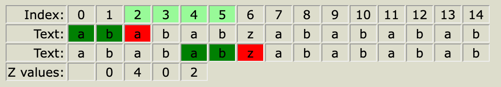

    计算完`z[4] == 2`之后, 更新 z-box 为`[4, 5]`这个区间
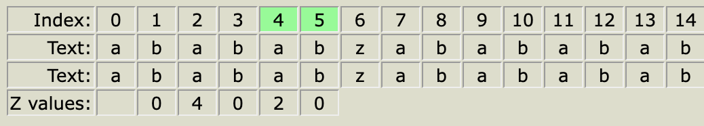

7.  `z[5]`: 5 这个下标也落在了 z-box 当中, 因此可以利用 z-box 中的信息, 通过z-box 中提供的信息可以知道`str[5] == str[1]`, 而`z[1]`之前已经计算出来`z[1] == 0`, 意味着`str[1] != str[0]`, 因此我们得到`str[5] != str[0]`, 因此`z[5] == 0`
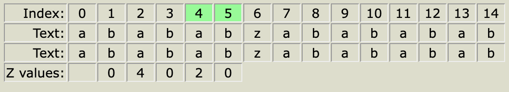
8.  `z[6]`: 6这个下标落在了当前 z-box 的外面, 因此需要暴力匹配, 暴力比较`str[6]`和`str[0]`, 发现`str[6] != str[0]`, 因此`z[6] = 0`
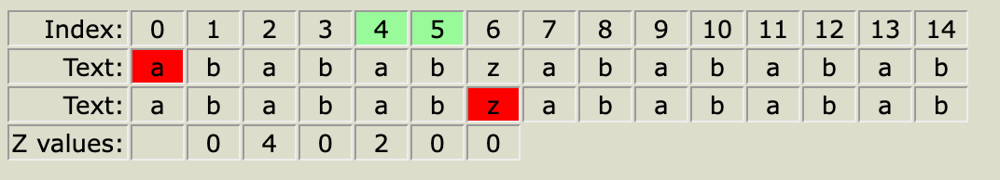
9. `z[7]`: 7这个下标落在当前 z-box 外面, 暴力匹配得到`z[7] == 6`
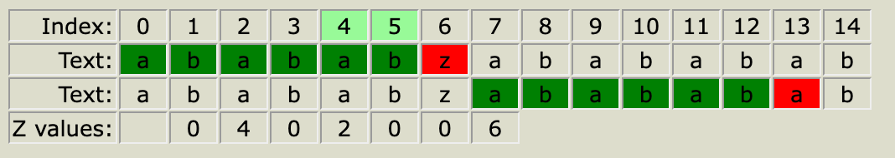
更新 z-box 为`[7, 12]`这个区间
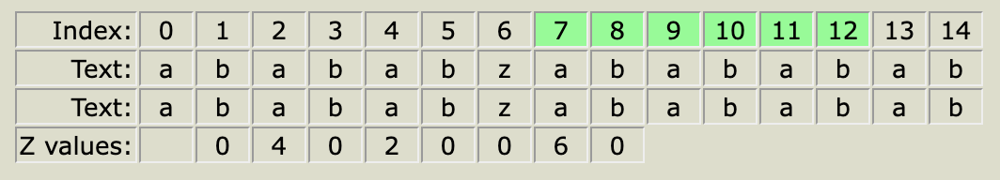
10.  `z[8]`: 下标8在当前 z-box 当中, 可以利用z-box中的信息, 通过z-box可以知道, `str[8] == str[1]`, 通过`z[1] == 0`可以知道`str[1] != str[0]`, 因此有`str[8] != str[0]`, 因此`z[8] = 0`
11.  `z[9]`: 依旧是落在z-box区间中, 通过z-box得到`str[9] == str[2], str[10] == str[3], str[11] == str[4], str[12] == str[5]`, 通过`z[2] == 4`可以知道`str[2] == str[0], str[3] == str[1], str[4] == str[2], str[5] == str[3]`, 联合上面两个式子可以得到`str[9] == str[0], str[10] == str[1], str[11] == str[2], str[12] == str[3]`, 再往后面匹配`str[13]`与`str[4]`时, 当前z-box就无法提供更多信息了, 就需要暴力匹配, 暴力匹配`str[13] == str[4]`, 继续暴力匹配`str[14] == str[5]`, 继续往后就没有字符了, 因此得到`z[9] == 6`
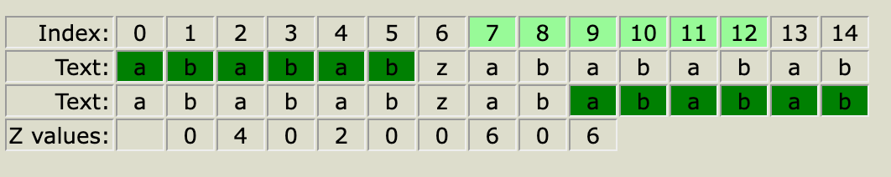
更新当前z-box为`[9, 14]`这个区间
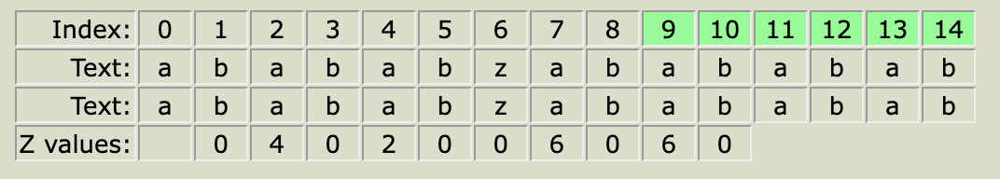
12.  `z[10]`: 落在z-box里面, 因此有`str[10] == str[1]`, 通过`z[1] == 0`得到`str[1] != str[0]`, 因此`str[10] != str[0]`, 故`z[10] = 0`
13.  `z[11]`: 落在z-box里面, 因此有`str[11] == str[2], str[12] == str[3], str[13] == str[4], str[14] == str[5]`, 通过`z[2] == 4`得到`str[2] == str[0], str[3] == str[1], str[4] == str[2], str[5] == str[3]`, 联合上面两个式子得到`str[11] == str[0], str[12] == str[1], str[13] == str[2], str[14] == str[3]`, 因此得到`z[11] = 4`
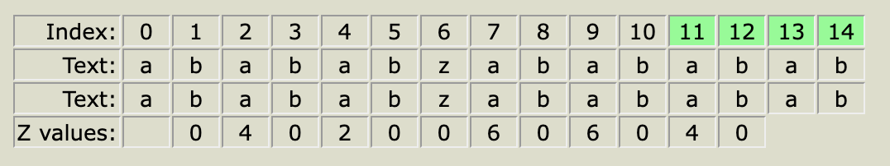
更新z-box为`[11, 14]`这个范围
14.  `z[12]`: 落在z-box里面, 因此有`str[12] == str[1]`, 通过`z[1] == 0`得到`str[1] != str[0]`, 因此`str[12] != str[0]`, 因此`z[12] = 0`

15.  `z[13]`: 落在z-box当中, 因此有`str[13] == str[2], str[14] == str[3]`, 通过`z[2] == 4`得到`str[2] == str[0], str[3] == str[1], ... str[5] == str[3]`, 联立上面两个式子得到`str[13] == str[0], str[14] == str[1]`, 因此`z[13] = 2`
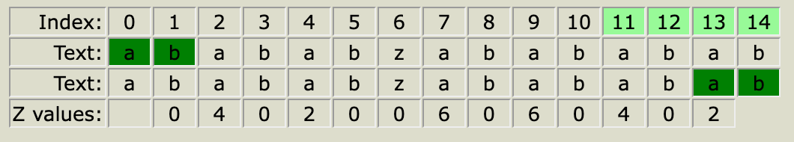
同理更新 z-box 为 `[13, 14]`这个区间
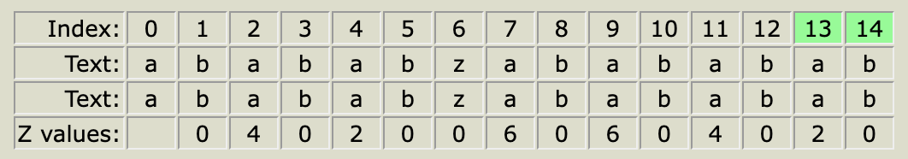
16.  `z[14]`: 14这个下标落在 z-box 当中, 因此有`str[14] == str[1]`, 而`z[1] == 0`说明`str[1] != str[0]`, 因此得到`str[14] != str[0]`, 因此`z[14] = 0`
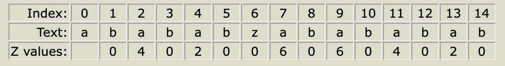

这样我们就得到了`str`对应的`z`数组

>注: 在上面`z[3]`的计算中, 我是用的直接比较`str[3]`和`str[0]`是否相等, 而没有利用到当前的z-box, 这是因为此时对于读者来说是第一次接触z-box, 如果直接使用z-box来进行比较可能会看不懂, 因此我就用的暴力比较来得到的`z[3]`的值, 但是相信你看到这里, 其实也就大概明白了z-box的原理, 因此这里可以更正一下`z[3]`的计算方法: 
>
>`z[3]`: 3这个下标落在了当前的 z-box 当中, 因此有`str[3] == str[1]`, 而`z[1] == 0`, 说明`str[1] != str[0]`, 通过上面两个式子得到`str[3] != str[0]`, 因此得到`z[3] = 0`


### 示例2

通过示例1, 应该可以大概理解z-func的主要思想, 下面我会再用一个示例再加深一下印象

`str = aabcaabxaaaz`

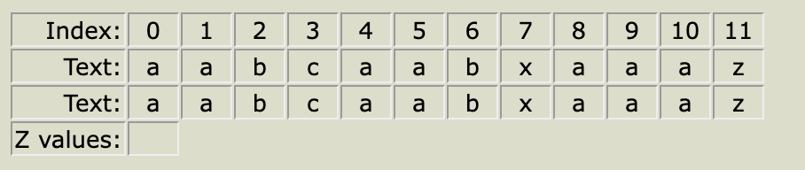

1. `z[0]`: 没有意义
2. `z[1]`: 暴力匹配, `str[1] == str[0], str[2] != str[1]`, 因此`z[1] = 1`, 并且更新当前z-box区间为`[1]`
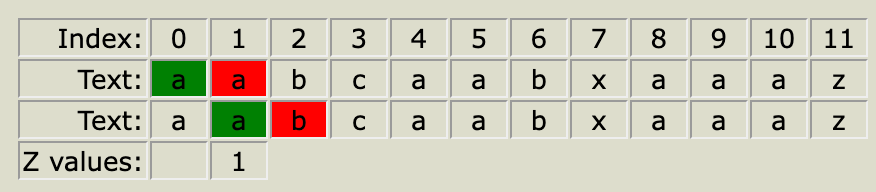
3. `z[2]`: 2这个下标不在当前z-box当中, 继续暴力匹配, `str[2] != str[0]`, 因此`z[2] = 0`
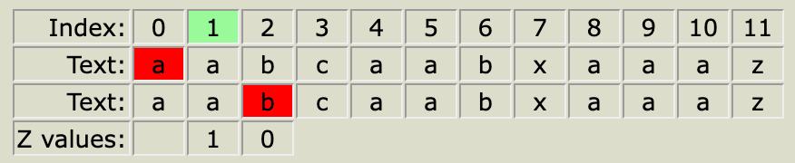
4. `z[3]`: 依旧不在z-box当中, 因此继续暴力匹配, `str[3] != str[0]`, 因此`z[3] = 0`
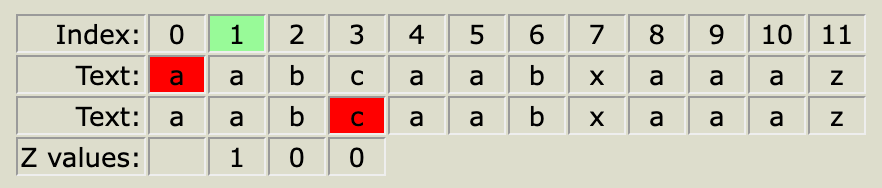
5. `z[4]`: 4不在z-box当中, 因此暴力匹配, `str[4] == str[0], str[5] == str[1], str[6] == str[2], str[7] != str[3]`, 因此`z[4] == 3`, 并且更新当前z-box区间为`[4, 6]`
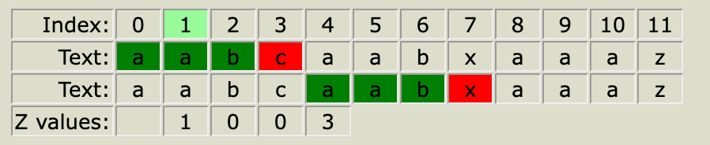
6. `z[5]`: 5这个下标在当前z-box当中, 因此有`str[5] == str[1], str[6] == str[2]`, 并且前面算出来了`z[1] == 1`, 因此有`str[1] == str[0], str[2] != str[1]`, 联合上面两个式子有`str[5] == str[0], str[6] != str[1]`, 因此`z[5] = 1`
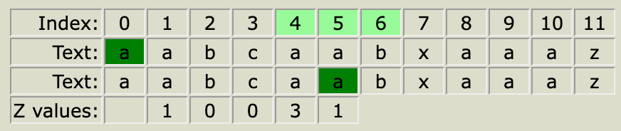
7. `z[6]`: 6这个下标也在当前z-box当中, 因此有`str[6] == str[2]`, 而`z[2] == 0`, 因此有`str[2] != str[0]`, 联合上面两个式子, 有`str[6] != str[0]`, 因此`z[6] = 0`
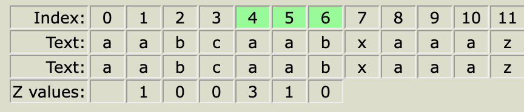
8. `z[7]`: 7这个下标在z-box外面, 因此暴力匹配, `str[7] != str[0]`, 因此`z[7] = 0`
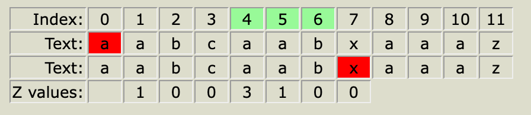
9. `z[8]`: 8这个下标也不在z-box里面, 因此继续暴力匹配, `str[8] == str[0], str[9] == str[1], str[10] != str[2]`, 因此`z[8] = 2`
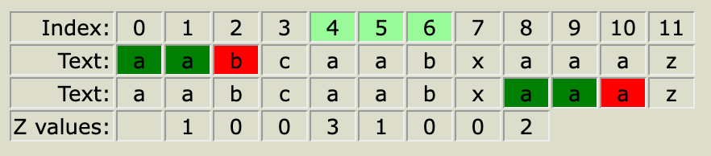
并且更新当前z-box区间为`[8, 9]`
10. `z[9]`: 9这个下标在当前z-box当中, 因此有`str[9] == str[1]`, 而`z[1] == 1`, 意味着`str[1] == str[0]`, 联合上面两个式子, 有`str[9] == str[0]`, 因此我们知道`z[9]`至少是1, 因为继续往后匹配时, 就超出了z-box的范围, z-box无法继续提供信息, 因此需要暴力匹配, `str[10] == str[1], str[11] != str[2]`, 因此最终`z[9] = 2`, 并且更新当前z-box区间为`[9, 10]`
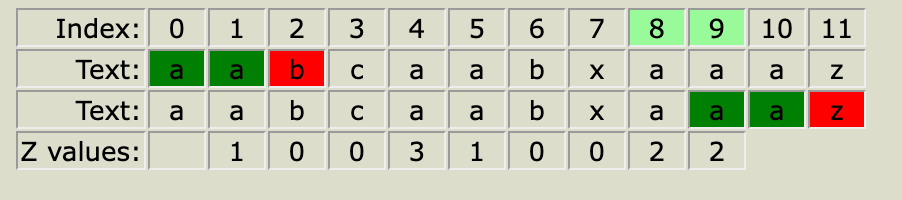
11. `z[10]`: 10这个下标在当前z-box当中, 因此有`str[10] == str[1]`, 而`z[1] == 1`, 因此有`str[1] == str[0]`, 联合上面两个式子有`str[10] == str[0]`, 因此得到`z[10]`至少为1, 继续向后暴力匹配, `str[11] != str[1]`, 因此最终`z[10] = 1`, 更新z-box区间为`[10]`
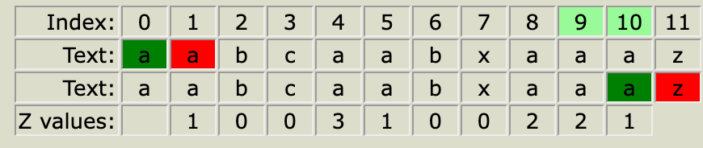
12. `z[11]`: 11这个下标不在当前z-box当中, 因此进行暴力匹配, `str[11] != str[0]`, 因此`z[0] = 0`
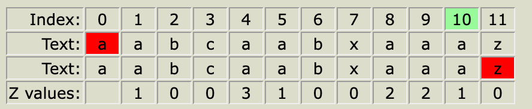

因此最终z函数的结果为

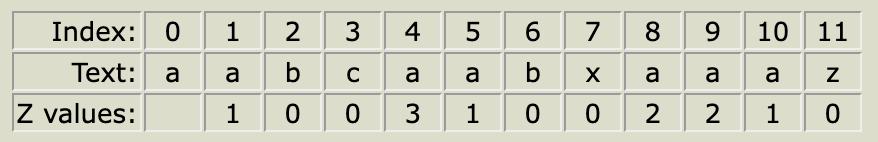


**总结**

通过上面两个例子, 我们可以得到z-func的主要思想

1. 如果当前要计算的这个下标不在当前的z-box当中, 或者此时压根就没有z-box, 那么此时需要暴力匹配
2. 如果从某一个下标`i`开始的后缀, 能够匹配`str`的某一个前缀, 假设从i开始的后缀的范围是`[i, i + len]`, 匹配的前缀的区间为`[0, len]`, 那么更新当前的z-box区间为`[i, i + len]`
3. 如果当前的下标`i`落在z-box当中, 那么此时就可以利用z-box中的信息来加速匹配过程(就不再是暴力匹配了)
   
   具体来说, 假设当前z-box的范围是`[zLeft, zRight]`(并且满足`zLeft <= i <= zRight`, 因为当前下标`i`落在z-box当中), 那么首先我们知道当前z-box能够提供的信息的最长的长度就是`zRight - i + 1`
   
   通过当前的z-box的范围我们可以知道`[i, zRight]`这个区间 和 `[i - zLeft, zRight - zLeft]`这个区间的子串是相等的(即下图中两个绿色阴影区域), 而`[i - zLeft, zRight - zLeft]`这个区间(即下图中左边的这个阴影区间)中`z[i - zLeft]`这个位置的z函数值我们是知道的, 也就是`i - zLeft`这个下标开始的后缀, 和整个字符串`str`能够匹配`z[i - zLeft]`这些长度, 因此我们可以知道`i`这个下标开始的后缀, 和整个字符串`str`能够匹配的长度应该至少为`z[i - zLeft]`这些长度, 但是需要注意, 这里`z[i]`的长度还会受到前一段分析出来的`zRight - i + 1`的限制, 因为如果`z[i - left] > zRight - i + 1`, 那么多出来的这一部分实际上就不在当前的z-box当中了, 换句话说, 多出来的这部分就超出了下图中的绿色阴影部分的范围了, 因此应该取`min(z[i - left], zRight - i + 1)`

   因此综合上面这两段分析出来的信息, 我们可以知道, 当`i`在z-box当中时, 当前`z[i]`应该至少为`min(zRight - i + 1, z[i - zLeft])`, 所谓"至少"的意思就是: 

    1. 如果 `z[i - zLeft] <= zRight - i + 1` , 那么不需要继续暴力匹配, 因为z-box中的信息足以证明`z[i] = z[i - Left]`
    2. 如果`z[i - zLeft] > zRight - i + 1`, 那么此时`z[i]`至少是`zRight - i + 1`, 至于是否还可以继续向后匹配, 此时z-box就不能再提供信息了, 只能继续向后暴力匹配

    对于这一点, 可以总结一下: 如果`i`落在当前z-box当中, 那么只需要从`i + min(z[i - zLeft], zRight - i + 1)`这个下标开始继续向后暴力匹配即可
   
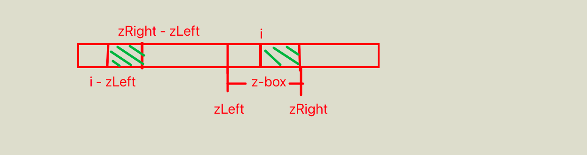

4. 每次计算完`z[i]`之后, 如果`z[i] > 0`, 那么更新当前的z-box, 更新为`[i, i + z[i] - 1]`

### z-func 代码实现

通过上面总结中这四点的分析, 其实不难写出求一个字符串的z数组的代码

```
int[] zFunc(String str){
    int n = str.length();
    int[] z = new int[n];
    z[0] = n;   // z[0]其实并没有意义, 如果一定要填的话, 可以认为z[0] = str.length()
    int zLeft = -1, zRight = -1;
    for(int i = 1;i < n;i++){
        if(i < zRight){
            z[i] = Math.min(zRight - i + 1, z[i - zLeft]);
        }
        while(i + z[i] < n && str.charAt(i + z[i]) == str.charAt(z[i])) {
            zLeft = i;
            zRight = i + z[i];
            z[i]++;
        }
    }
    return z;
}
```

### 时间复杂度

在计算z数组的过程中, z-box 始终都是向右移动的, 类似滑动窗口, 因此z-func的时间复杂度是O(n)

# kmp

### 主要思想

kmp解决的是 "原串 和 模式串 的匹配问题"


# 相关题目

#### [LC3031](https://leetcode.cn/problems/minimum-time-to-revert-word-to-initial-state-ii/description/)

z-func

```
public int minimumTimeToInitialState(String word, int k) {
    int n = word.length();
    int[] z = zFunc(word);
    for(int i = 0;i < n - 1;i++){
        if((i + 1) % k == 0 && z[i + 1] == n - i - 1){
            return (i + 1) / k;
        }
    }
    return n % k == 0 ? n / k : n / k + 1;
}

int[] zFunc(String str){
    int n = str.length();
    int[] z = new int[n];
    z[0] = n;
    int zLeft = -1, zRight = -1;
    for(int i = 1;i < n;i++){
        if(i < zRight){
            z[i] = Math.min(zRight - i + 1, z[i - zLeft]);
        }
        while(i + z[i] < n && str.charAt(i + z[i]) == str.charAt(z[i])) {
            zLeft = i;
            zRight = i + z[i];
            z[i]++;
        }
    }
    return z;
}
```

#### [LC3036](https://leetcode.cn/problems/number-of-subarrays-that-match-a-pattern-ii/description/)
