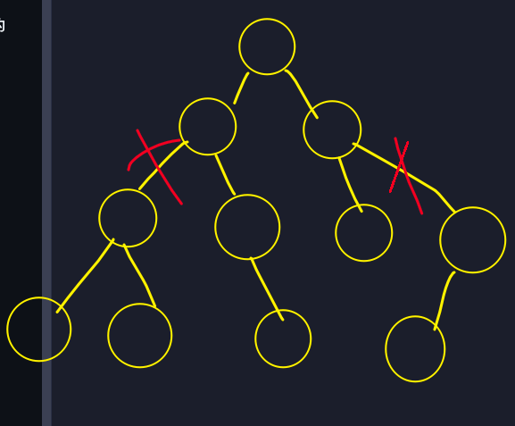
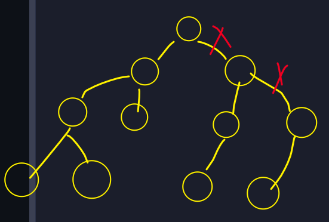
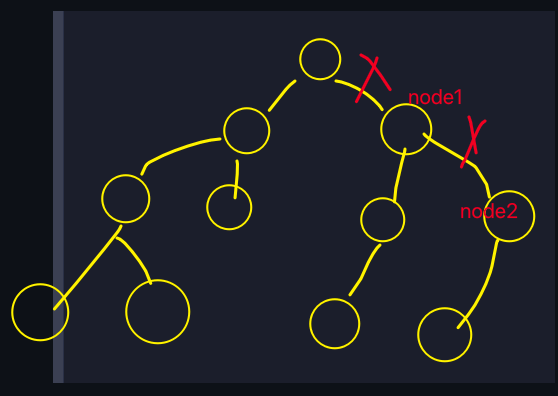
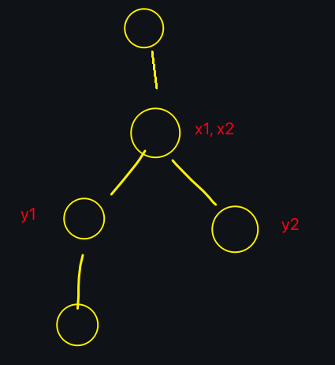

## DFS时间戳

这是一个很巧妙的技巧, 有很多意想不到的妙用

### 1. [LC2322](https://leetcode.cn/problems/minimum-score-after-removals-on-a-tree/description/)

这题是一个很综合的题 即用到了 DFS时间戳, 还用到了 异或`^`的性质

题意: 给定一棵树, 求删除两条边之后, 三个联通分量各自的异或值中的 最大值和最小值的差 的最小值

首先看数据范围, 本题的数据范围保证边的数量不会超过`1000`, 因此可以考虑枚举要删除的两条边的所有可能情况

于是问题转化为了: 给定当前要删除的两条边的情况下, 要使用时间复杂度尽可能低的算法, 求出被删除的两条边分成的三个联通分量各自的异或值

> 这里用到了有关 异或`^` 的一个巧妙的性质: `a ^ b ^ a == b`, 简单来说, 在原来`a ^ b`的基础上, 如果再异或上一个`a`, 那么结果就是会将原本的异或结果`a ^ b`中的`a`给去掉, 只剩下`b`

利用这个巧妙的性质, 我们就可以很快速的求出 给定要删除的两条边的情况下, 被分成的三个联通分量各自的异或值

这里把删除两条边之后, 剩余的三个连通块之间的关系分为三种情况

1. 三个连通块中有两个连通块是完整的一棵子树, 剩下那部分是第三个连通块

如图: 

2. 三个连通块中只有一个连通块是完整的子树, 剩下那部分包括剩下的两个连通块

如图: 

首先我们可以通过一次`DFS`**预处理**出所有子树的异或值, 保存在一个数组中

然后根据上面两种情况分别进行计算

1. 对于第一种情况, 对于两边的这两个连通块, 由于这两个连通块都是完整的子树, 因此我们只需要知道这两棵子树的根节点, 就可以从预处理的数组中直接得到这两棵子树的异或值

    然后对于剩下的这一部分的异或值, 由于在预处理中, 我们同时也知道了整棵树的异或值, 根据异或的性质, `第三个连通块的异或值 = 整棵树的异或值 ^ 第一个连通块的异或值 ^ 第二个连通块的异或值`

2. 对于第二种情况

由于包含`node2`的这一个连通块是一棵完整的子树, 因此这棵子树的异或值可以在预处理的数组中直接得到

然后就是包含`node1`的这个连通块, 虽然这个连通块不是一个完整的子树, 但是仍然可以利用异或的性质, 快速得到这个连通块的异或值: `包含node1的连通块的异或值 = 以node1为根节点的子树的异或值 ^ 以node2为根节点的子树的异或值`

最后是包含原本的根节点的连通块的异或值: `包含原本根节点的连通块的异或值 = 整棵树的异或值 ^ 包含node1的连通块的异或值`

通过上面的分析, 我们已经得到了, 在两种情况下如何利用预处理的信息, 以及异或的性质, 在`O(1)`的时间内计算得到三个连通块各自的异或值

接下来的问题变成了, 如何快速确定当前删除两条边之后, 分成的三个连通块是第一种情况, 还是第二种情况? 

比较第一种情况和第二种情况可以发现, 被划分成的三个连通块中, 一定会有一个连通块的根节点是原本二叉树的根节点, 然后根据剩下两个连通块的根节点的相对位置, 可以区分上面的两种情况

在上面划分出来的第一种情况中, 剩下的两个连通块的根节点, 一定不是对方的祖先节点

而在第二种情况中, 剩下的两个连通块的根节点, 其中一个根节点是另外的根节点的父节点

根据这一点, 就可以区分上面两种情况

于是问题又转化成了: 如何快速判断某一个节点是不是另外一个节点的根节点?

这里用到了最关键的知识点: **DFS时间戳**

什么是时间戳?

时间戳就是一个全局变量, 每次我们进入到一个新节点时, 让这个全局变量++, 并且记录进入这个节点时, 全局时间戳的值, 作为进入这个节点的时间, 当离开这个节点时, 再记录离开这个节点时, 全局时间戳的值, 作为离开这个节点的时间

时间戳有什么好处? 

在本题中, 假如我们遍历的时候选择的是 先序遍历, 那么: 

假设当前进入了`node`这个节点, 并且记录此时的时间戳`in[node] = cnt++`, 然后遍历当前`node`节点的所有子节点, 递归遍历完`node`的所有子节点之后, 在离开当前`node`节点向上返回之前, 再记录一次当前的时间戳`out[node] = cnt'` (这里使用`cnt'`是因为离开时的时间戳的值**一般来说**都和进入时不同 (显然如果当前`node`没有子节点, 那么进入和离开时的时间戳显然应该是相同的))

那么通过这段描述可以看出, 如果有一个节点`node1`, 并且`node1`是`node`的子节点, 那么显然进入`node1`的时间, 一定会晚于进入`node`的时间, 并且离开`node1`的时间, 一定会早于离开`node`的时间 (这都是由 **先序遍历** 的特性保证的)

使用一个不等式表述上面这段话的含义, 即: 

假设此时有两个节点`node`和`node1`, 那么一定满足: 

`in[node] <= in[node1] <= out[node1] <= out[node]`

通过上面这个式子, 我们就可以很快速地判断两个节点是否有祖先关系

如果两个节点存在祖先关系, 即其中某一个节点是另外的一个节点的父节点, 那么这两个节点, 假设分别为`node1, node2`, 一定满足 `in[node2] <= in[node1] <= out[node1] <= out[node2]` 或 `in[node1] <= in[node2] <= out[node2] <= out[node1]`

但是这里还有一个问题: 对于枚举到的某一个边, 我们怎么知道这条边连接的两个节点的父子关系?

为什么会出现这个问题? 因为我们只是枚举了边, 而不知道这条边连接的两个节点的上下关系, 即假设当前这条边连接的两个节点分别是`node1, node2`, 这里我们并不知道`node1`和`node2`的父子关系, 因此就不知道这两条边划分出来的这三个连通块是什么样的情况, 进而也就无法确定这三个连通块的根节点是谁, 也就无法求这三个连通块各自的异或值

因此这里我们可以在枚举两条边之前, 对`edges`数组进行一下预处理, 枚举`edges`中所有的边, 对于某一条边连接的两个节点`[node1, node2]`, 如果`node1`是`node2`的子节点, 那么就`swap`这两个节点, 换句话说, 这样进行预处理之后, 我们能够保证, `edges[i][]`连接的两个节点, 第一个节点一定是第二个节点的父节点, 或者说第一个节点一定在第二个节点的上面

因此这样当我们枚举两条边的一种可能情况之后, 就能够**确定**删除这两条边之后, 得到的三个连通块各自都是以哪个节点作为根节点

这样做还有一个好处, 就是能够确定`isParent(x, y)`判断中的顺序

> 这里的`isParent(x, y)`的作用, 就是判断`x`是否是`y`的父节点

由于我们想要区分删除的两条边分割的三个连通块的两种不同情况, 需要判断其中的两个连通块的根节点之间的祖先关系, 而对于选中的两条边, 此时会出现4个相关的节点, 那么此时我们需要选择哪两个节点来判断祖先关系呢?

在一开始做的时候, 我错误的认为, 随便选两个节点来判断均可, 只要这两个节点分别位于两个连通块中即可

但是实际上这样是错误的, 可能会导致判断的错误, 比如可以看下面这个例子

在上面这个例子中, 如果我们使用`isParent(x1, x2)`来判断, 会发现这两棵子树具备祖先关系, 然而实际上, 这两棵子树并不具备祖先关系

从上面这个例子中可以看出来, 我们不能任意选择`x1, y1`和`x2, y2`中的两个节点来判断祖先关系

而是应该选择 **第一条边靠下面的节点 和 第二条边靠上面的节点** 或 **第一条边靠上面的节点 和 第二条边靠下面的节点** 来进行判断

这里 靠上面的节点, 也就是靠近根节点, 靠下面的节点, 也就是远离根节点

换句话说, 假设第一条边连接的两个节点分别是`x1, y1`, 并且`x1`是`y1`的父节点, 第二条边连接的两个节点分别是`x2, y2`, 并且`x2`是`y2`的父节点, 那么我们应该判断`isParent(y1, x2)`和`isParent(y2, x1)`

> 确定要判断哪两个点的祖先关系非常重要, 我一开始做这个题的时候, 就选择了错误的两个节点来判断, debug了很久才发现这个问题

从这个方面也可以看出, 提前预处理`edges`, 使得`edges[i][0]`一定是`edges[i][1]`的父节点是非常有必要的

到此为止, 本题所有需要用到的算法思想就都介绍完了, 最后总结一下整个流程

1. 预处理: 预处理出每一棵子树的异或值, 保存在数组中, 并且在先序遍历的同时, 使用DFS时间戳, 记录进入和离开每一个节点的时间
2. 首先枚举要删除的两条边的所有可能
3. 找到这三个连通块的根节点, 其中一个连通块的根节点一定是原本二叉树的根节点, 假设另外两个连通块的根节点分别为`node1, node2`
4. 根据`node1, node2`的位置关系, 具体来说就是 `node1`和`node2`之间是否存在**祖先关系** (即`node1`是`node2`的祖先, 或者`node2`是`node1`的祖先), 判断要删除的两条边是两种可能情况中的哪一种
5. 根据上一步判断出来的情况, 利用异或的性质, 即可在`O(1)`的时间内, 求出当前情况下三个连通块各自的异或值

### 2. [LC3327](https://leetcode.cn/problems/check-if-dfs-strings-are-palindromes/)

这题的`DFS时间戳`使用的非常巧妙

首先根据题目中`dfs(int x)`计算`dfsStr`的顺序可以知道, 这里的`dfsStr`, 其实就是以`x`为根的子树的后序遍历得到的字符串序列

那么这里有一个非常重要的性质需要了解: 假设整棵树的后序遍历对应的字符串是`str`, 那么对于其中一棵子树的后序遍历字符串`subStr`来说, 此时`subStr`一定是`str`的一个子串

可以这样来理解这个结论: 首先假设`subStr`对应的子树的根节点是`x`, 那么在后序遍历整棵二叉树计算`str`的过程中, 一定会递归到`x`这个子节点, 进而就会递归后序遍历以`x`为根节点的这棵子树, 并且显然递归到`x`, 并且进而递归`x`的子树的过程中一定是连续的, 因此显然`subStr`就一定是`str`的一个子串

有了上面这个结论, 那么我们要想判断`x`为根节点的子树后序遍历得到的`subStr`是否是回文串, 只需要找到`subStr`在整棵二叉树后序遍历得到的字符串`str`中的起始和结束位置, 然后使用`Manacher`判断这个子串是否是回文即可

> Manacher算法我也有写过, 详见 `/notes/Manacher` 模块

接下来问题就转化成了: 如何确定某个节点`x`后续遍历的字符串`subStr`在整棵二叉树后序遍历得到的字符串`str`中的起始和结束位置

